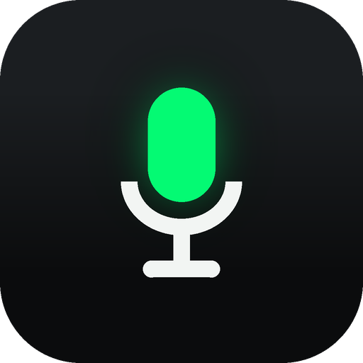
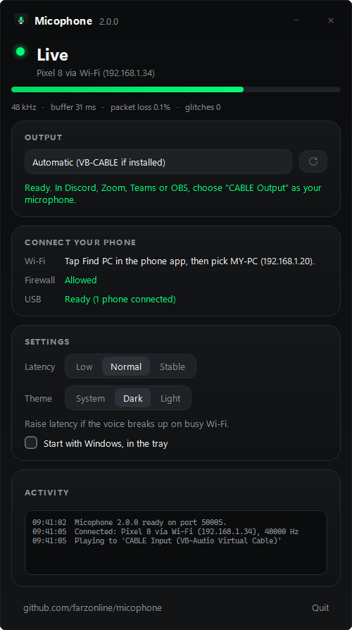
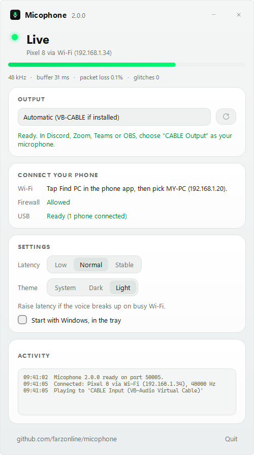

<div align="center">



# Micophone

**Use your Android phone as your Windows PC's microphone, over Wi-Fi or USB.**

[](https://github.com/farzonline/micophone/actions/workflows/ci.yml)
[](https://github.com/farzonline/micophone/releases/latest)
[](LICENSE)
 

[**Download**](https://github.com/farzonline/micophone/releases/latest) ·
[How to use](#how-to-use) · [Troubleshooting](#troubleshooting) · [Build it yourself](#build-from-source)

&nbsp;&nbsp;


</div>

A good phone microphone is better than most headset mics, and it's already in your pocket.
Micophone sends it to your PC as a normal microphone, so Discord, Zoom, Teams, OBS and
every other app can use it. It's free, open source, has no accounts, and needs no internet connection.

## Features

- **Wi-Fi or USB.** Wi-Fi needs no setup (the phone finds your PC itself). USB is the most stable and
  needs no network at all.
- **Reconnects by itself.** Walk out of Wi-Fi range, restart the PC app, replug the cable, or switch networks:
  streaming resumes without touching the phone.
- **No echo.** Audio goes into a virtual microphone ([VB-CABLE](https://vb-audio.com/Cable/)), not your
  speakers, so nothing feeds back into the phone.
- **Runs with the screen off.** Mute and Stop are in the notification.
- **Noise suppression** using the phone's call-quality audio pipeline (optional).
- **Adjustable latency.** A jitter buffer (20, 40 or 80 ms) with drift correction keeps the voice smooth
  on busy Wi-Fi without the delay slowly growing.
- **Clear status.** A level meter, packet loss and glitch counters on the PC; plain-language
  messages on the phone.
- **Lives in the tray.** Closing the window keeps your phone connected; quit from the tray or the Quit button.
  *Start with Windows* puts it straight in the tray.
- **Dark or light,** following Windows by default, in Farzonline green.
- **Tiny and private.** The Android app is under 2 MB, and audio only ever goes to your own PC.

## How it works

```
 phone mic ─ AudioRecord 48 kHz ─┬─ UDP ── Wi-Fi ─────────────────────────┐
  (+ noise suppression)          └─ TCP ── USB (adb reverse, automatic) ──┤
                                                                          ▼
   Micophone.exe ─ jitter buffer + drift correction ─ VB-CABLE ─ Discord / Zoom / OBS …
```

The phone sends 10 ms packets of raw 16-bit mono audio. Over Wi-Fi it uses UDP with a one-second
keepalive that the PC answers, so both sides notice a drop within about two seconds and recover on
their own. Over USB it uses a TCP connection through `adb reverse`, which the PC app sets up
automatically whenever a phone is plugged in. The full protocol is documented at the top of
[`pc/receiver.py`](pc/receiver.py).

## Install

**On the PC** (Windows 10 or 11)

1. Install [VB-CABLE](https://vb-audio.com/Cable/) (free). Unzip it, right-click `VBCABLE_Setup_x64.exe`,
   choose *Run as administrator*, then *Install Driver*.
2. Download `Micophone.exe` from the [latest release](https://github.com/farzonline/micophone/releases/latest)
   and run it. If the window shows **Allow** next to *Firewall*, click it once (it asks for admin).

**On the phone** (Android 8 or newer)

Download `Micophone.apk` from the same release page, open it, and allow installing from your browser
or file manager when Android asks. Google Play: coming soon.

## How to use

| | Phone | PC |
|---|---|---|
| **Wi-Fi** | Same Wi-Fi as the PC. Tap **Find PC on this Wi-Fi**, then **Start microphone**. | Nothing to do. |
| **USB** | Turn on *Developer options › USB debugging*, plug in, tap *Allow*. Pick **USB cable**, then **Start microphone**. | Nothing to do. If it says *adb not installed*, click **Install USB support**. |

Then, in Discord, Zoom, Teams, OBS or *Windows Settings › System › Sound › Input*, choose
**CABLE Output (VB-Audio Virtual Cable)** as your microphone.

Tips:

- **Latency** (PC app): *Low* for the least delay on good Wi-Fi, *Stable* if the voice breaks up. USB is the steadiest.
- **Noise suppression** (phone): turn it off if you want the raw sound, for example when recording music.
- **Start with Windows** (PC app) keeps Micophone ready in the tray. Closing the window doesn't stop it;
  right-click the tray icon and choose *Quit Micophone* (or press **Quit** in the window) to exit.

### About echo

Micophone plays into VB-CABLE, so you don't hear yourself and nothing loops back. If people on a call
hear *their own* voice echoing, your PC speakers are reaching the phone's microphone: use headphones, or
turn on echo cancellation in the call app (Discord: *Voice & Video › Echo Cancellation*). If the PC app says
*Playing out loud through …*, select **CABLE Input** as the output.

## Troubleshooting

| Symptom | Fix |
|---|---|
| **Find PC** finds nothing | Is the PC app open? Same Wi-Fi (not a guest network with client isolation)? Click **Allow** next to *Firewall* in the PC app, or type the address shown there. |
| Phone says *Connecting… Is Micophone open on the PC?* | Same as above. Windows' "Public network" profile blocks it until you click **Allow**. |
| *… is busy with another phone* | Only one phone at a time. Stop the other one; it frees up within 3 seconds. |
| USB: *tap Allow on the phone's USB debugging prompt* | Unlock the phone and accept the prompt (tick *Always allow*). |
| Voice breaks up | PC app › Latency › *Stable*, or use USB. The counters under the level meter show loss and glitches. |
| The phone stops after a while with the screen off | Some phone brands kill background apps. Settings › Apps › Micophone › Battery › *No restrictions*. |
| No sound in a call app | The call app must use **CABLE Output** as its microphone, not your normal one. |

Logs are in `%LOCALAPPDATA%\Micophone\micophone.log`. Please attach them when you
[report a problem](https://github.com/farzonline/micophone/issues/new/choose).

## Build from source

You need Python 3.10+ (Windows) for the PC app and a JDK 21 plus the Android SDK for the phone app.

```powershell
# PC app
cd pc
pip install -r requirements.txt
python test_receiver.py        # self-check, prints "ok"
python micophone_gui.py        # run it from source
python micophone_gui.py --demo # made-up data, for screenshots
build.bat                      # builds dist\Micophone.exe

# Phone app (or just open android/ in Android Studio)
cd android
./gradlew assembleDebug        # debug APK
```

`python pc/receiver.py --help` runs the PC side without a window. Release signing, tags and the CI
pipeline are described in [docs/RELEASING.md](docs/RELEASING.md); contributions are welcome
([CONTRIBUTING.md](CONTRIBUTING.md)).

## Privacy

Micophone has no accounts, analytics or ads, and it never uses the internet. Microphone audio goes only to
the PC you chose, over your local network or a USB cable, and is not stored. Full text:
[PRIVACY.md](PRIVACY.md).

## Code signing policy

Free code signing provided by [SignPath.io](https://about.signpath.io/), certificate by
[SignPath Foundation](https://signpath.org/).

- **Team roles:** author, committer, reviewer and approver: [@farzonline](https://github.com/farzonline).
- **Builds:** every signed `Micophone.exe` is built by the public
  [GitHub Actions release workflow](.github/workflows/release.yml) from a tagged commit of this repository.
- **Privacy:** this program will not transfer any information to other networked systems unless
  specifically requested by the user or the person installing or operating it. (The one network request
  Micophone can make is the optional *Install USB support* button, which downloads Google's Android
  platform-tools.)

## License

[MIT](LICENSE). VB-CABLE is a separate product by VB-Audio and isn't included; Micophone only links to it.
